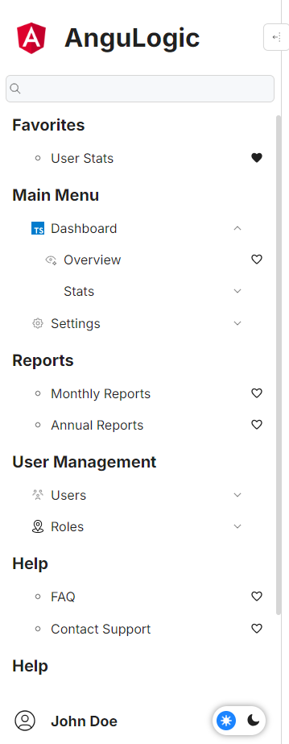
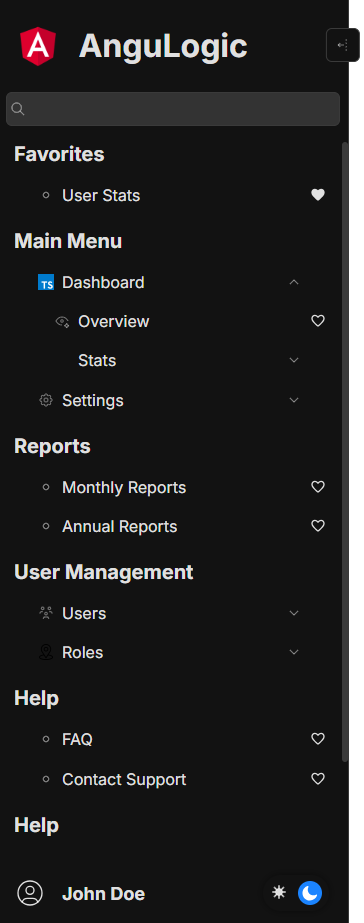

# @angulogic/ng-sidebar

[](https://www.npmjs.com/package/@angulogic/ng-sidebar)  
[](https://github.com/skarahan35/angulogic/blob/dev/LICENSE)


@angulogic/ng-sidebar is a dynamic, interactive, and highly configurable Angular sidebar component designed to provide a rich navigation experience in your Angular applications. It supports nested menus, search functionality, favorites management, theme toggling, responsive view modes, and resizable/auto-position capabilities.

---

  

## Table of Contents

- [Features](#features)
- [Installation](#installation)
- [Usage](#usage)
  - [Basic Usage](#basic-usage)
  - [Advanced Configuration](#advanced-configuration)
  - [CSS Customization](#css-customization)
- [API Documentation](#api-documentation)
  - [Models](#models)
  - [Events](#events)
  - [Methods](#methods)
- [Development](#development)
- [Contributing](#contributing)
- [License](#license)
- [Maintainers](#maintainers)

---

## Features

- **Dynamic Menu Navigation:**  
  Create multiple sidebar sections with nested menu items and submenus.

- **Search & Favorites:**  
  Integrated search functionality with configurable matching strategies (`contains`, `startsWith`, `endsWith`, `equal`) and a favorites management system.

- **Custom Banner & User Profile:**  
  Display a customizable banner (logo and title) and user profile section with click callbacks.

- **Responsive & Flexible:**  
  Supports various view modes such as `toggle`, `hover`, `mobile`, and `fix`. Auto-positioning adapts the layout dynamically.

- **Resizable Sidebar:**  
  End users can resize the sidebar while respecting minimum and maximum width constraints.

- **Theme Switching:**  
  Built-in light/dark theme support along with an optional theme picker.

- **Extensible Callbacks:**  
  Provides hooks for events like menu item clicks, toggles, search start/end, resizing events, and theme changes.

---

## Installation

Install @angulogic/ng-sidebar via npm:

```bash
npm install @angulogic/ng-sidebar
```

---

## Usage

### Basic Usage

```typescript
import { NgSidebarModule } from '@angulogic/ng-sidebar';
import { SidebarModel } from '@angulogic/ng-sidebar';

@NgModule({
  imports: [NgSidebarModule],
})
export class AppModule {}

@Component({
  selector: 'app-root',
  templateUrl: './app.component.html',
})
export class AppComponent {
  sidebarModel: SidebarModel = {
    bannerOptions: {
      title: 'My App',
      logo: 'assets/logo.png',
    },
    userOptions: {
      name: 'John Doe',
      avatar: 'assets/avatar.png',
    },
    sidebarData: [
      {
        title: 'Main Menu',
        data: [
          { name: 'Dashboard', route: '/dashboard' },
          { name: 'Settings', route: '/settings' },
        ],
      },
    ],
    options: {
      expand: true,
      theme: 'light',
    },
  };
}
```

```html
<ng-sidebar [options]="sidebarModel"></ng-sidebar>
```

### Advanced Configuration

You can customize the sidebar with content projection using directives like:

```html
<ng-sidebar [options]="sidebarModel">
  <div al-sidebar-banner>Custom Banner Content</div>
  <div al-sidebar-top-user>Custom User Content</div>
  <div al-sidebar-menu>Custom Menu Content</div>
</ng-sidebar>
```
### CSS Customization

You can customize the appearance of the sidebar by overriding CSS variables:

```css
ng-sidebar {
  --primary: red !important;
  --bg-color: #f0f0f0 !important;
}
```

#### Available CSS Variables
| **Variable**                                | **Description**                                      | **Default Value**       |
|---------------------------------------------|----------------------------------------------------|-------------------------|
| `--radius`                                  | Border radius for UI elements                       | `6px`                   |
| `--collapse-width`                          | Width when the sidebar is collapsed                 | `100px`                 |
| `--sidebar-width`                           | Default width of the sidebar                        | `250px`                 |
| `--bg-color`                                | Background color of the sidebar                     | `white`                 |
| `--text-color`                              | Default text color                                  | `#000000de`             |
| `--primary`                                 | Primary color used for highlights                   | `#1b84ff`               |
| `--primary-2`                               | Secondary shade of primary color                   | `#4394f1`               |
| `--primary-3`                               | Tertiary shade of primary color                    | `#5c9be4`               |
| `--secondary`                               | Secondary color                                     | `#d6d6d6`               |
| `--secondary-2`                             | Lighter shade of secondary color                   | `#e9e9e9`               |
| `--secondary-3`                             | Lightest shade of secondary color                  | `#f3f3f3`               |
| `--default-font-family`                     | Default font family                                 | `'Inter', sans-serif`   |
| `--collapsed-banner-padding-right`          | Padding right for the collapsed banner              | `1rem`                  |
| `--resizer-color`                           | Color of the resizer                                | `#1b84ff`               |
| `--resizer-width`                           | Width of the resizer                                | `5px`                   |
| `--resizer-height`                          | Height of the resizer                               | `100%`                  |
| `--resizer-right`                           | Positioning from the right                         | `-3px`                  |
| `--resiver-top`                             | Positioning from the top                           | `0`                     |
| `--toggle-border-radius`                    | Border radius of toggle button                      | `6px`                   |
| `--toggle-border-color`                     | Border color of toggle button                       | `#d6d6d6`               |
| `--toggle-bg-color`                         | Background color of toggle button                   | `white`                 |
| `--toggle-border-width`                     | Border width of toggle button                       | `1px`                   |
| `--search-width`                            | Width of the search bar                             | `100%`                  |
| `--search-icon-left`                        | Left position for search icon                      | `0.75rem`               |
| `--search-icon-top`                         | Top position for search icon                       | `50%`                   |
| `--search-input-border-radius`              | Border radius of the search input                   | `6px`                   |
| `--search-input-border-color`               | Border color of the search input                   | `#d6d6d6`               |
| `--search-input-border-width`               | Border width of the search input                   | `1px`                   |
| `--search-input-bg-color`                   | Background color of the search input               | `#f6f8fa`               |
| `--search-input-color`                      | Text color of the search input                     | `#333333`               |
| `--search-input-width`                      | Width of the search input                          | `100%`                  |
| `--search-input-height`                     | Height of the search input                         | `2rem`                  |
| `--search-input-padding`                    | Padding for the search input                       | `0px 1.5rem`            |
| `--search-input-margin`                     | Margin for the search input                        | `0px 0.5rem`            |
| `--search-cancel-icon-right`                | Right position for search cancel icon              | `0.75rem`               |
| `--search-cancel-icon-top`                  | Top position for search cancel icon                | `50%`                   |
| `--menu-padding`                            | Padding for the menu                               | `0px 1rem`              |
| `--menu-margin`                             | Margin for the menu                                | `1rem 0px`              |
| `--menu-height`                             | Height of the menu                                 | `100%`                  |
| `--menu-wrapper-margin-bottom`              | Bottom margin for the menu wrapper                 | `1rem`                  |
| `--menu-wrapper-collapsed-margin-bottom`    | Bottom margin when the menu is collapsed           | `0px`                   |
| `--menu-wrapper-collapsed-color`            | Text color for collapsed menu                      | `#d6d6d6`               |
| `--menu-wrapper-title-font-size`            | Font size for menu section titles                  | `20px`                  |
| `--menu-wrapper-title-padding-bottom`       | Bottom padding for menu section titles             | `0.5rem`                |
| `--user-name-font-weight`                   | Font weight for the user name                      | `bold`                  |
| `--user-name-font-size`                     | Font size for the user name                        | `large`                 |
| `--scrollbar-height`                        | Height of the scrollbar                            | `0.4rem`                |
| `--scrollbar-width`                         | Width of the scrollbar                             | `0.4rem`                |
| `--banner-height`                           | Height of the banner                               | `10%`                   |
| `--banner-padding`                          | Padding for the banner                             | `1rem`                  |
| `--banner-logo-height`                      | Height of the banner logo                          | `5rem`                  |
| `--banner-title-font-size`                  | Font size of the banner title                      | `xx-large`              |
---

## API Documentation

## Models

| **Model**       | **Property**             | **Type**                      | **Description**                                       | **Default**   |
|-----------------|--------------------------|-------------------------------|-----------------------------------------------------|---------------|
| `SidebarModel`  | `bannerOptions`          | `Banner`                      | Configuration for sidebar banner                     | `undefined`   |
|                 | `userOptions`            | `User`                        | User profile section configuration                   | `undefined`   |
|                 | `sidebarData`            | `SidebarData[]`               | Array of sidebar sections and menus                  | `[]`          |
|                 | `options`                | `SidebarOptions`              | General sidebar settings                             | `undefined`   |
|                 | `searchOptions`          | `Search`                      | Configuration for search functionality               | `undefined`   |
|                 | `favorites`              | `MenuData[]`                  | List of favorite menu items                          | `[]`          |
|                 | `theme`                  | `'light' , 'dark'`            | Current sidebar theme                                | `'light'`     |
|                 | `viewMode`               | `'toggle' , 'hover'`          | Sidebar display mode                                | `'toggle'`    |
| `Banner`        | `logo`                   | `string`                      | Sidebar logo URL                                    | `undefined`   |
|                 | `title`                  | `string`                      | Sidebar banner title                                | `undefined`   |
|                 | `onClick`                | `(element) => void`           | Callback when banner elements are clicked           | `undefined`   |
| `User`          | `avatar`                 | `string`                      | User avatar URL                                     | `undefined`   |
|                 | `name`                   | `string`                      | Display name for the user                           | `undefined`   |
|                 | `position`               | `'top' , 'bottom'`            | Position of the user profile                        | `'bottom'`    |
|                 | `onClick`                | `(element) => void`           | Callback when user elements are clicked             | `undefined`   |
| `SidebarData`   | `title`                  | `string`                      | Title of the sidebar section                        | `undefined`   |
|                 | `cssClass`               | `string`                      | Custom CSS class                                    | `undefined`   |
|                 | `visible`                | `boolean`                     | Visibility of the section                           | `true`        |
|                 | `data`                   | `MenuData[]`                  | Array of menu items                                 | `[]`          |
| `MenuData`      | `name`                   | `string`                      | Name of the menu item                               | `undefined`   |
|                 | `icon`                   | `string`                      | Icon URL for the menu item                          | `undefined`   |
|                 | `route`                  | `string`                      | Navigation route                                    | `undefined`   |
|                 | `visible`                | `boolean`                     | Visibility of the menu item                         | `true`        |
|                 | `isExpanded`             | `boolean`                     | Expansion state for submenus                        | `false`       |
|                 | `isFavorited`            | `boolean`                     | Favorite status of the menu item                    | `false`       |
|                 | `children`               | `MenuData[]`                  | Nested submenu items                                | `[]`          |
|                 | `onClick`                | `(event) => void`             | Callback for menu item click                        | `undefined`   |
| `SidebarOptions`| `resize`                 | `boolean`                     | Enables resizing of the sidebar                     | `true`        |
|                 | `expand`                 | `boolean`                     | Enables sidebar expansion                          | `true`        |
|                 | `theme`                  | `'light' , 'dark'`            | Sidebar theme                                      | `'light'`     |
|                 | `autoPosition`           | `boolean`                     | Enables automatic positioning                      | `true`        |
|                 | `minWidth`               | `number`                      | Minimum width of the sidebar                        | `300`         |
|                 | `maxWidth`               | `number`                      | Maximum width of the sidebar                        | `500`         |
| `Search`        | `placeholder`            | `string`                      | Placeholder text for the search bar                 | `undefined`   |
|                 | `caseSensitive`          | `boolean`                     | Enables case sensitivity in searches               | `false`       |
|                 | `strategy`               | `'contains' , 'startsWith', 'endsWith' , 'equal'`   | Defines search strategy                            | `'contains'`  |
|                 | `onSearchStart`          | `(event) => void`             | Callback for search start event                    | `undefined`   |
|                 | `onSearchEnd`            | `(event) => void`             | Callback for search end event                      | `undefined`   |

For more details on the available models, refer to the source code documentation.

---

### Methods

| **Method**          | **Description**                               | **Parameters**                  |
|---------------------|----------------------------------------------|---------------------------------|
| `changeTheme()`     | Switches between light and dark themes       | None                            |

---

## Development

### Run Locally

```bash
git clone https://github.com/skarahan35/angulogic.git
npm install
npm run start
```

### Build for Production

```bash
cd projects/ng-sidebar
npm run build
```

---

## Contributing

We welcome contributions to @angulogic/ng-sidebar!

1. Fork the repository.
2. Create a new branch: `git checkout -b feature/your-feature-name`
3. Make your changes and commit: `git commit -m 'Add new feature'`
4. Push to your branch: `git push origin feature/your-feature-name`
5. Open a pull request.

---

## License

@angulogic/ng-sidebar is licensed under the [MIT License](LICENSE).

---

## Maintainers

- [Serkan Karahan](https://github.com/skarahan35)  
- [Ergül Ferik](https://github.com/ergulferik)

Enjoy building with **@angulogic/ng-sidebar**! 🚀

